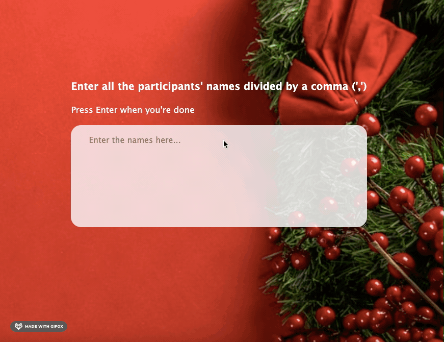

## Description

This little Secret Santa app will take a list of (at least 3) participants names as input and randomly assign each participant to a Secret Santa.

The results can be drawn anew randomly with the same list, or the list can be edited to draw the results again with the edited list.

## Demo

## Credits

Some elements of the UI and the typing out effect when writing in the textarea are from [this cool little project](https://github.com/bradtraversy/50projects50days/tree/master/random-choice-picker) from [https://github.com/bradtraversy](@bradtravery).